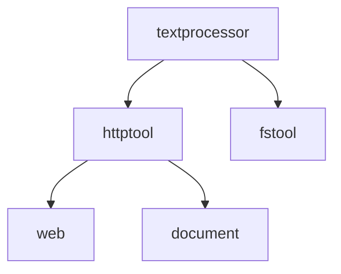

# Toolsy Toolkits

Enterprise-ready building blocks for AI agents: each module supports **library mode** (pure functions/DTOs) and **tool mode** (`AsTools` / `AsTool` factories).

## Dual mode

| Module     | Library API                            | Tool factory   |
| ---------- | -------------------------------------- | -------------- |
| `timetool` | `ComputeCurrent`, `CalculateResult`    | `AsTools`      |
| `httptool` | `SafeDialTransport`, `ReadBodyLimited` | `AsTools`      |
| `web`      | `SearchStructured`, `ScrapePage`       | `AsTools`      |
| `rag`      | `Document`, router primitives          | `AsSearchTool` |
| `sqltool`  | `InspectResult`, `ExecuteResult`       | `AsTools`      |
| `document` | `ExtractWireResult`                    | `AsTool`       |

## IoC: custom output shape

Host applications can inject formatters returning `any` (domain DTOs). Toolsy serializes the result to JSON on the wire.

```go
timetool.AsTools(
    timetool.WithResultFormatter(func(r timetool.CurrentResult) (any, error) {
        return map[string]string{"ts": r.UTC}, nil
    }),
    timetool.WithHostResultValidator(func(v any) error {
        // PII / injection checks before marshal
        return nil
    }),
)
```

Supported in: `timetool` (`WithResultFormatter`, `WithCalculateResultFormatter`), `web`, `rag`, `sqltool` (`WithExecuteResultFormatter`, `WithInspectResultFormatter`), `document`.

When a byte budget option is set (`WithMaxBytes`, `WithMaxPageBytes`, `WithMaxSearchBytes`, `WithMaxSchemaBytes`, sqltool row/cell limits), it applies to **final wire JSON** (`format.MarshalWireCap` / `format.ApplyWithEnvelope` + `CapWireJSON`), including default tool paths without a formatter.

### Byte budget and suffix taxonomy

| Tier           | Where                                        | Suffix                                                                                | Notes                                                      |
| -------------- | -------------------------------------------- | ------------------------------------------------------------------------------------- | ---------------------------------------------------------- |
| **Wire**       | `format.CapWireJSON` on tool paths           | `\n[Truncated]` (`textprocessor.TruncationSuffix`)                                    | One user-visible suffix per tool response                  |
| **Semantic**   | sqltool rows/cells, web search hit list      | `SQLRowsTruncationSuffix`, `SQLCellTruncationSuffix`, `SearchResultsTruncationSuffix` | Domain limits (rows, cells, hits); independent of wire cap |
| **DoS / read** | HTML scrape read, httptool probe body | no suffix on scrape (`ReadLimited(..., "")`); suffix in httptool probe `body` field | Memory safety; scrape follows document/agents pattern |
| **Probe**      | `httptool.AsTools` DTO                       | suffix in `body` field                                                                | Status in JSON; separate from toolkit wire cap             |

Content pre-cap in parsers (`document`, `rag` JSON shape) uses hard UTF-8 chop **without** `\n[Truncated]`; only wire marshal adds the suffix.

Cross-package validators can type-assert exported wire DTOs (`CalculateResult`, `SearchWireResult`, `SearchMarkdownWire`, etc.).

### Validator vs formatter priority

| Module                                      | Formatter set                    | Validator receives                                   |
| ------------------------------------------- | -------------------------------- | ---------------------------------------------------- |
| `rag` (default markdown)                    | no                               | `SearchMarkdownWire`                                 |
| `rag` (+ formatter or `ShapeDocumentsJSON`) | yes                              | formatter output or `SearchDocumentsWire`            |
| `web` search                                | `[]SearchResult` to formatter    | `SearchWireResult` envelope only when validator-only |
| `web` scrape                                | `string` (markdown) to formatter | `ScrapeWireResult` envelope only when validator-only |
| `timetool` / `sqltool`                      | typed DTO to formatter           | default envelope only when validator-only            |

When both formatter and validator are set, validation runs on the formatter return value (`ApplyWithEnvelope` order).

## Wrapper pattern

Wrap toolkit tools with host middleware **before** registering:

```go
builder := toolsy.NewRegistryBuilder()
tools, _ := httptool.AsTools(httptool.WithAllowedDomains([]string{"api.example.com"}))
for _, t := range tools {
    builder.Add(hostMiddleware.Wrap(t)) // audit, rate limit, PII filter
}
```

See [`examples/resiliency`](../../examples/resiliency/main.go) for core toolsy middleware patterns.

## SSRF

HTTP egress protection is centralized in `httptool` (`SafeDialTransport`, `NewSafeHTTPClient`, `ValidateRemoteURL`, `CheckRedirectRemote`). Only modules with **HTTP egress** depend on `httptool`:

| Consumer    | Uses httptool for                                  |
| ----------- | -------------------------------------------------- |
| `web`       | scrape client, redirect validation                 |
| `document`  | remote URL fetch (IP-only; no host blacklist)      |
| `agents`    | REST client, SSE stream steps                      |
| `contracts` | OpenAPI/GraphQL execute and spec fetch             |
| `mcp`       | SSE GET/POST (`WithSSEHTTPClient`, URL validation) |
| `httptool`  | `AsTools` HTTP GET                                 |

Leaf modules without HTTP (`fstool`, `sqltool`, `timetool`, `rag`, `mail`, …) must **not** import `httptool`. Local file reads use `textprocessor` (see `fstool.readFileLimited`).

`ReadBodyLimited` is an HTTP response primitive; do not use it for filesystem reads.



Host HTTP clients should reuse `SafeDialTransport`. `web` scrape and `document` remote fetch delegate to `httptool.NewSafeHTTPClient`.
